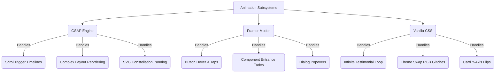

# Design Specification: Portfolio

## 1. Universal Design Tokens & Theme Engine

> [!IMPORTANT]
> The **Cyber** theme is the foundational system. All `.module.css` components reference abstract semantic tokens (e.g. `var(--neon)`), ensuring global theme synchronization across the app.

### Comprehensive Palette Mapping
*Mapped from [`globals.css`](file:///d:/Antigravity/Projects/Portfolio/src/app/globals.css)*

| Token Semantic | Hex Base (Cyber) | Purpose | UI Reflection |
| :--- | :--- | :--- | :--- |
| **`--neon`** | `#00F5FF` (Cyan) | Primary action, active states, active links, glow halos. | Call-to-action buttons, primary terminal inputs. |
| **`--neon2`** | `#BF5FFF` (Purple)| Secondary emphasis, gradient stops, hover trails. | Constellation skill node highlights. |
| **`--bg`** | `#070C1A` (Navy) | Absolute background void, particles canvas depth. | Behind the Three.js mesh canvas. |
| **`--bg2`** | `#0D1425` (Graphite)| Foreground surface panels, floating cards. | Base layer of `MechPanel` or `GlassPanel`. |
| **`--glass`** | `rgba(0,245,255,0.04)`| Transparent ambient blurring, subtle borders. | Floating window effects, modals. |
| **`--border`** | `rgba(0,245,255,0.15)`| Structural lines, technical schematic grids. | Input boxes, UI dividers. |
| **`--text`** | `#C8D8E8` (Ice) | Standard text paragraphs and headers. | Article bodies, case study text. |
| **`--dim`** | `#5A7A9A` (Slate) | De-emphasized text, timestamps, captions. | Metadata, tags, footer links. |

### Global Typography Framework
- **Primary Display (`Orbitron`)**: Variable weight font for headers (H1-H3), numerical stats, and logos.
- **Monospace Systems (`Share Tech Mono`)**: Technical readouts, terminal syntax, and UI pill badges.
- **Body Context (`Inter` / `Rajdhani`)**: High legibility sans-serif for extended reading contexts.

---

## 2. Interaction & Animation Choreography

> [!NOTE]
> We enforce a strict separation of concerns for animations to guarantee 60 FPS under heavy WebGL loads.

---

## 3. Core Component Library

### HUD & Overlay Systems
- [`Navbar.tsx`](file:///d:/Antigravity/Projects/Portfolio/src/components/Navbar.tsx): Adaptive scroll-linked header with glassmorphism filtering.
- [`ThemeHUD.tsx`](file:///d:/Antigravity/Projects/Portfolio/src/components/ThemeHUD.tsx): The physical UI controller injecting `data-theme` directly into the DOM tree.
- [`RoleBadge.tsx`](file:///d:/Antigravity/Projects/Portfolio/src/components/RoleBadge.tsx): Sector-selection tool linking user viewport preferences with global context providers.
- [`BackgroundSystem.tsx`](file:///d:/Antigravity/Projects/Portfolio/src/components/BackgroundSystem.tsx): GPU-accelerated orbital canvas (Three.js/Fiber).

### UI Primitives
- [`MechButton.tsx`](file:///d:/Antigravity/Projects/Portfolio/src/components/ui/MechButton.tsx): Brutalist, glowing interface button.
- [`GlassPanel.tsx`](file:///d:/Antigravity/Projects/Portfolio/src/components/ui/GlassPanel.tsx): Highly optimized blurred container module.
- [`TerminalCLI.tsx`](file:///d:/Antigravity/Projects/Portfolio/src/components/ui/TerminalCLI.tsx): Syntactic-styled backend emulator.

---

## 4. Responsive Engineering Protocols

> [!TIP]
> **Fluid Scaling over Breakpoints**: Instead of maintaining rigid media queries, sizing is calculated using `clamp()` functions and relative units (`vw`, `vh`) to ensure flawless scaling from 320px up to 4K displays.
> 
> **Data-Viz Handling**: Complex SVG architectures (like `SkillConstellation.tsx`) utilize dynamic `viewBox` calculations instead of `display: none` hiding on mobile devices, ensuring feature parity across all viewports.
