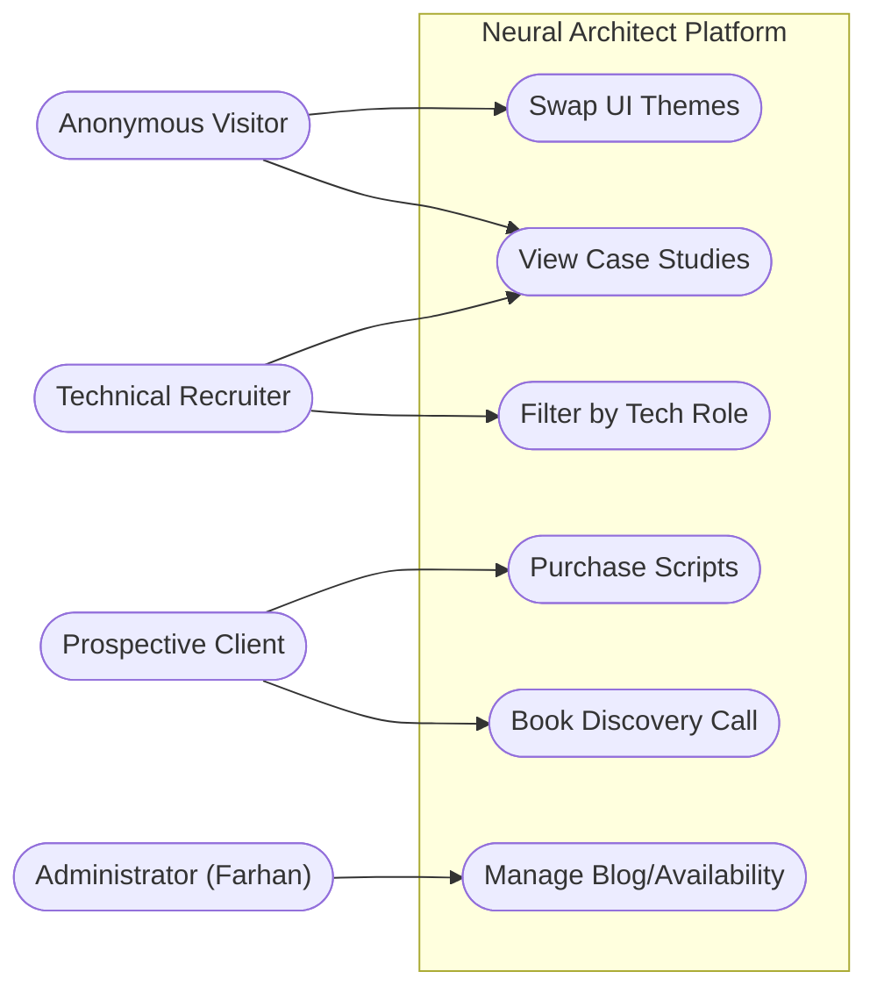
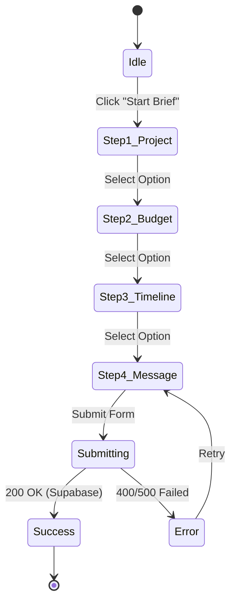

# Requirements Specification: Portfolio

## 1. System Actor Map & Use Cases

---

## 2. Functional Requirements Matrix (MoSCoW)

### 🔴 MUST HAVE (Core Operation)
| ID | Requirement Details | Traceability / Link |
| :--- | :--- | :--- |
| **FR-01** | The homepage MUST render a layered cinematic scroll driven by GSAP without blocking the main thread. | [`HeroSection.tsx`](file:///d:/Antigravity/Projects/Portfolio/src/components/home/HeroSection.tsx) |
| **FR-02** | The Theme engine MUST support 6 dynamic variations via CSS variable injection. | [`globals.css`](file:///d:/Antigravity/Projects/Portfolio/src/app/globals.css) |
| **FR-03** | The multi-step contact wizard MUST validate user input and POST securely to Supabase. | [`ContactSection.tsx`](file:///d:/Antigravity/Projects/Portfolio/src/components/home/ContactSection.tsx) |
| **FR-04** | Role context switching MUST instantly re-filter the visual Constellation map and showcased projects. | [`RoleContext.tsx`](file:///d:/Antigravity/Projects/Portfolio/src/context/RoleContext.tsx) |

### 🟡 SHOULD HAVE (Engagement Drivers)
| ID | Requirement Details | Traceability / Link |
| :--- | :--- | :--- |
| **FR-05** | An interactive Terminal CLI simulating backend command interfaces. | [`TerminalCLI.tsx`](file:///d:/Antigravity/Projects/Portfolio/src/components/ui/TerminalCLI.tsx) |
| **FR-06** | Real-time fetch of GitHub repository metadata using ISR (Incremental Static Regeneration). | [`github-api.ts`](file:///d:/Antigravity/Projects/Portfolio/src/lib/github-api.ts) |
| **FR-07** | MDX-based blogs supporting syntax highlighting and scroll reading metrics. | `/app/blog/page.tsx` |

### 🟢 COULD HAVE (Scale Features)
| ID | Requirement Details | Traceability / Link |
| :--- | :--- | :--- |
| **FR-08** | E-commerce integration via Razorpay for digital products. | `/app/marketplace` |
| **FR-09** | AI Chat Assistant with RAG integration querying Qdrant vector database. | `/app/chat` |

---

## 3. Strict Non-Functional Requirements (NFRs)

> [!IMPORTANT]
> Failure to meet these NFRs constitutes a failed build pipeline.

1. **Performance Budget (Core Web Vitals)**:
   - **LCP (Largest Contentful Paint)**: $< 2.5s$.
   - **FID (First Input Delay)**: $< 100ms$.
   - **CLS (Cumulative Layout Shift)**: $< 0.1$.
2. **Accessibility (WCAG 2.1 AA)**:
   - All interactive terminal interfaces and 3D flip-cards MUST support native `Tab` focusing.
   - SVG maps must define strict structural boundaries and ARIA labels.
3. **SEO & Metadata**:
   - `sitemap.xml` and `robots.txt` must be auto-generated during Next.js builds.
   - JSON-LD structured data must be appended to all case studies and blog templates.

---

## 4. Complex Interaction Flows

### Contact Wizard State Machine

