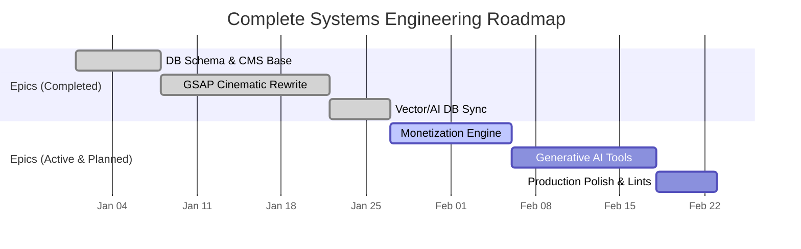
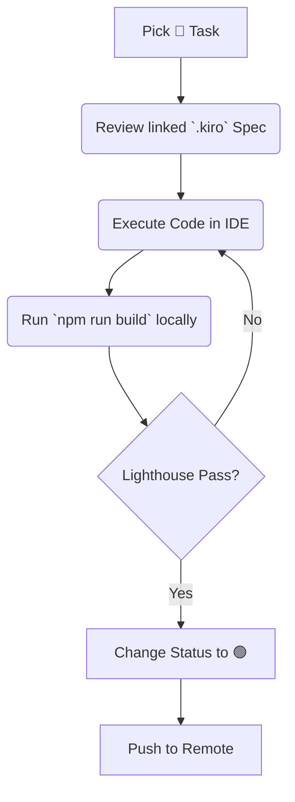

# Developer Task Tracker: Portfolio

> [!TIP]
> **Execution Protocol**: This document operates as the central kanban blueprint. Each task is a discreet sprint module (estimated at 30–60 minutes). Status tokens (`🔴`, `🟡`, `🟢`) indicate real-time pipeline status.

## 1. Master Project Lifecycle Gantt

---

## 2. 🟢 Delivered Epics: Foundation & Core Experience

| Status | Task Module | System Achieved | Link to Spec |
| :---: | :--- | :--- | :--- |
| 🟢 | **Core Stack Baseline** | Lint rules, Tailwind matrices, Orbitron bindings. | [tech.md](file:///d:/Antigravity/Projects/Portfolio/.kiro/steering/tech.md) |
| 🟢 | **Supabase Network** | Configured `snyvarunuobcpfadkpmc`, Auth layers, DB schemas. | [tech.md](file:///d:/Antigravity/Projects/Portfolio/.kiro/steering/tech.md) |
| 🟢 | **Data Ingestion** | Synthesized external records into `src/data/about.json`. | [structure.md](file:///d:/Antigravity/Projects/Portfolio/.kiro/steering/structure.md) |
| 🟢 | **Theme Engine** | 6-theme mapping with instantaneous glitch transitions. | [design.md](file:///d:/Antigravity/Projects/Portfolio/.kiro/specs/portfolio/design.md) |
| 🟢 | **Cinematic Home** | GSAP orchestrated layers, scroll-pinning, text reveals. | [requirements.md](file:///d:/Antigravity/Projects/Portfolio/.kiro/specs/portfolio/requirements.md) |
| 🟢 | **SVG Skill Nodes** | Intelligent SVG constellation map resolving to 12 sectors. | [design.md](file:///d:/Antigravity/Projects/Portfolio/.kiro/specs/portfolio/design.md) |
| 🟢 | **Edge Functions** | Qdrant Vector sync operating on `pg_cron`. | [tech.md](file:///d:/Antigravity/Projects/Portfolio/.kiro/steering/tech.md) |

---

## 3. 🟡 Active Sprint: Monetization & Conversion

> [!WARNING]
> These modules contain financial infrastructure. High code review rigor and idempotency testing are required.

| Status | Task Module | Detailed Acceptance Criteria | Est. Time |
| :---: | :--- | :--- | :--- |
| 🟢 | **Services Dashboard** | Interactive `/services` layout with live slider calculators. | `Done` |
| 🔴 | **`/hire` Landing System**| Construct conversion pipeline tailored to agencies, omitting generic bloat. | `45m` |
| 🔴 | **Store Architecture** | Build `/store` catalog parsing available digital goods and course data. | `60m` |
| 🔴 | **Razorpay Tunnels** | Implement checkout scripts, verify cryptographic signatures in Supabase webhooks. | `90m` |
| 🔴 | **Automated Fulfillment** | Link Resend API to dispatch secure, time-limited download URLs. | `45m` |

---

## 4. 🔴 Future Backlog: Generative Scale & Final Polish

| Status | Task Module | Detailed Acceptance Criteria | Est. Time |
| :---: | :--- | :--- | :--- |
| 🔴 | **AI Tools Router** | Launch `/tools` hosting utility calculators (e.g., Readme Builder) via LLM. | `60m` |
| 🔴 | **Redis Rate Walls** | Prevent API burnout utilizing FingerprintJS hashed to Redis counts. | `45m` |
| 🔴 | **RAG Chat Layer** | Launch `/chat` agent querying Qdrant vectors to answer platform inquiries. | `90m` |
| 🔴 | **Admin CMS Vault** | Authenticated control panel to flip availability banners and review incoming leads. | `60m` |
| 🔴 | **Global Asset Optimization**| Process heavy graphics to `.avif`/`.webp`, ensure lazy loading bounds. | `30m` |
| 🔴 | **SEO Compilation** | Validate `generateMetadata` scripts and deploy production Vercel/Netlify pipeline. | `45m` |

---

## 5. Execution Workflow Flowchart

