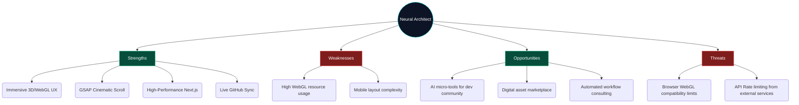
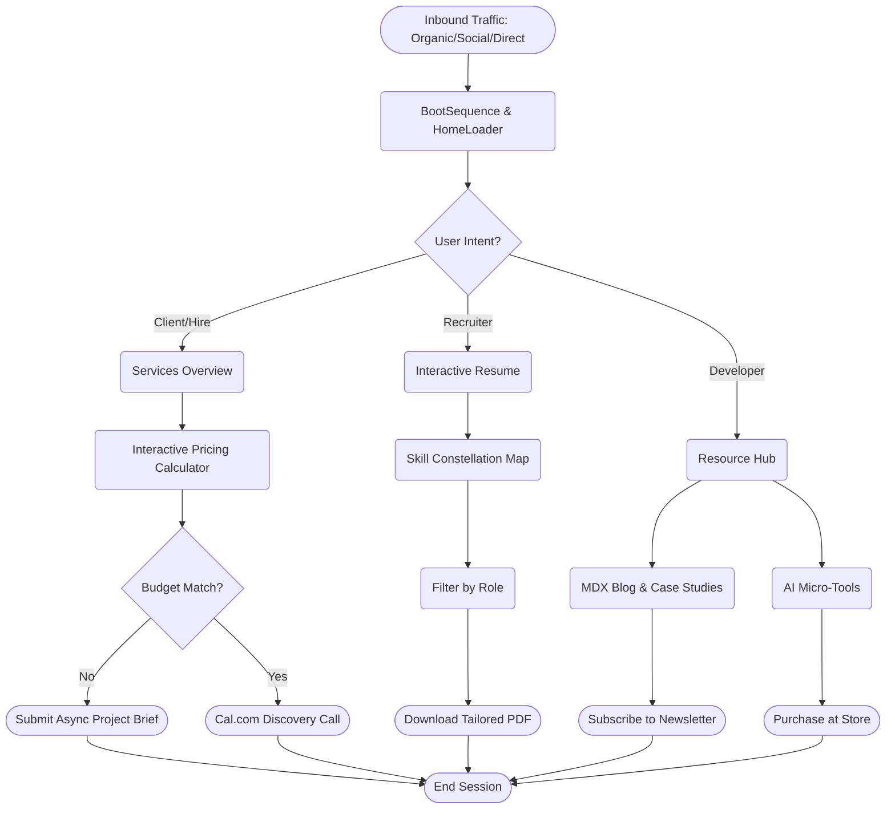

# Product Steering: Neural Architect Portfolio

> [!NOTE]
> **Executive Summary & Elevator Pitch**  
> The **Neural Architect** platform is a cinematic, high-fidelity developer portfolio and full-stack operational hub for **Farhan Mallik**. It transcends standard portfolios by functioning as a lead-generation pipeline, an e-commerce marketplace for digital assets, and an interactive showcase of generative AI capabilities.

---

## 1. Objectives and Key Results (OKRs)

| Objective | Key Result 1 | Key Result 2 | Key Result 3 |
| :--- | :--- | :--- | :--- |
| **O1: Maximize Lead Conversion** | Achieve > 5% conversion rate on `/hire` via the Contact Wizard. | Book 4+ discovery calls via Cal.com embed per month. | Capture 100+ newsletter subscribers via lead magnets in Q3. |
| **O2: Establish Brand Authority** | Retain average session duration > 2:30 minutes. | Zero drop-offs during the GSAP cinematic boot sequence. | 500+ monthly visits via organic SEO targeting 'automation engineer'. |
| **O3: Monetize Assets** | Launch 3 digital products on `/store`. | Achieve ₹50,000 MRR from digital products. | Implement Razorpay webhook integration with 100% idempotency. |

---

## 2. SWOT Analysis

---

## 3. Exhaustive User Personas

| Persona Identity | Primary Motivation | Technical Familiarity | Core User Journey | Platform Goal |
| :--- | :--- | :--- | :--- | :--- |
| **Startup Founder** | Needs a scalable MVP or automation to cut costs. | Low-Medium | Views Home -> Checks Services/Pricing -> Books Call. | Secure consulting gig. |
| **Engineering Manager**| Searching for top-tier full-stack talent. | High | Views Home -> Inspects Projects -> Evaluates `/dsa` & Tech Stack. | Secure job/contract offer. |
| **Junior Developer** | Wants to learn advanced UI, GSAP, or Next.js. | Medium | Reads Blog -> Plays with Terminal -> Tries AI Micro-Tools. | Grow community & newsletter. |

---

## 4. Deep System User Journey

---

## 5. Scope & Boundary Definition (MoSCoW)

> [!WARNING]
> To prevent infinite feature expansion, strictly adhere to these boundaries.

- **Must Have**: Cinematic GSAP homepage, Responsive SVG Constellation, Contact wizard, Multi-theme system.
- **Should Have**: AI Micro-tools, MDX Blog, 3D Certificate flip-cards, Qdrant Vector Sync.
- **Could Have**: Razorpay Digital Store checkout, `/chat` RAG AI agent, Codolio DSA Heatmaps.
- **Won't Have**: Real-time multi-user collaboration, Custom calendaring engine (delegated to Cal.com), Custom social media walls.
