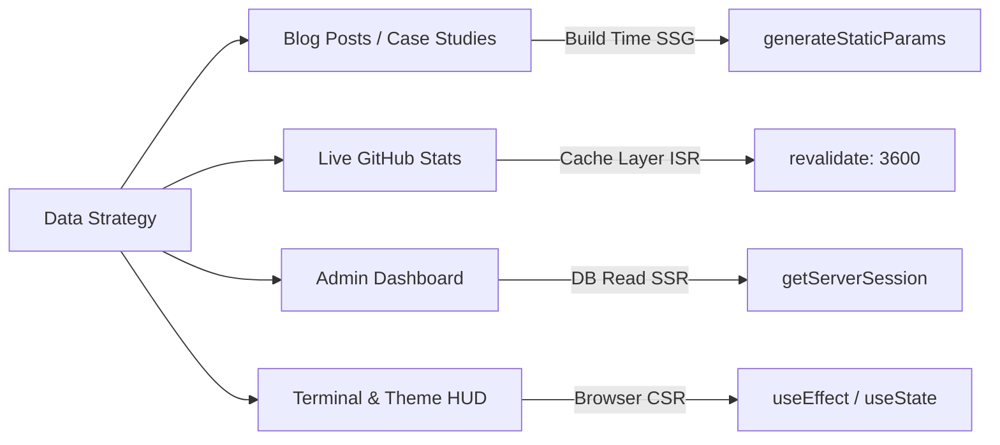
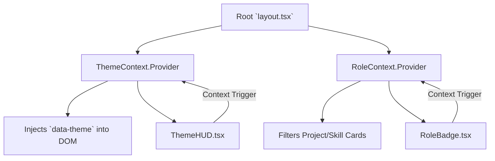

# Repository Structure: Neural Architect

## 1. Deep Project Mapping (Absolute Tree)

> [!NOTE]
> All paths below are absolute deep-links to the IDE. Click any file to open it directly.

- 📁 [`.kiro/`](file:///d:/Antigravity/Projects/Portfolio/.kiro/) — Centralized architecture tracking, design specs, and requirements.
- 📁 [`.planning/`](file:///d:/Antigravity/Projects/Portfolio/.planning/) — GSD state machines, execution histories, and workflow configurations.
- 📁 [`public/`](file:///d:/Antigravity/Projects/Portfolio/public/) — Optimized SVGs, manifest, icons, and WOFF2 fonts.
- 📁 [`src/`](file:///d:/Antigravity/Projects/Portfolio/src/) — **Application Core**
  - 📁 [`app/`](file:///d:/Antigravity/Projects/Portfolio/src/app/) — Next.js 13+ App Router definitions.
    - 📁 [`api/`](file:///d:/Antigravity/Projects/Portfolio/src/app/api/) — Serverless route handlers (`/api/contact`, `/api/github`).
    - 📁 [`[routes]/`](file:///d:/Antigravity/Projects/Portfolio/src/app/) — e.g. `/blog`, `/projects`, `/about`, `/admin`.
    - 📄 [`globals.css`](file:///d:/Antigravity/Projects/Portfolio/src/app/globals.css) — Global CSS variables and structural rules.
    - 📄 [`layout.tsx`](file:///d:/Antigravity/Projects/Portfolio/src/app/layout.tsx) — Main layout integrating Context Providers and HUDs.
    - 📄 [`page.tsx`](file:///d:/Antigravity/Projects/Portfolio/src/app/page.tsx) — The cinematic scrolling homepage.
  - 📁 [`components/`](file:///d:/Antigravity/Projects/Portfolio/src/components/) — Reusable UI Components.
    - 📁 [`home/`](file:///d:/Antigravity/Projects/Portfolio/src/components/home/) — Specialized wrappers (`HeroSection.tsx`).
    - 📁 [`ui/`](file:///d:/Antigravity/Projects/Portfolio/src/components/ui/) — Low-level atoms (`GlassPanel.tsx`, `TerminalCLI.tsx`).
    - 📁 [`skills/`](file:///d:/Antigravity/Projects/Portfolio/src/components/skills/) — Complex SVG mapping modules.
  - 📁 [`context/`](file:///d:/Antigravity/Projects/Portfolio/src/context/) — React Providers orchestrating global states.
  - 📁 [`data/`](file:///d:/Antigravity/Projects/Portfolio/src/data/) — Static ledgers simulating a local CMS (`skills.ts`, `projects.json`).
  - 📁 [`lib/`](file:///d:/Antigravity/Projects/Portfolio/src/lib/) — Instantiated singletons and API utilities (`qdrant.ts`, `github-api.ts`).
  - 📁 [`types/`](file:///d:/Antigravity/Projects/Portfolio/src/types/) — Zod validation schemas and TS interfaces.
  - 📁 [`utils/`](file:///d:/Antigravity/Projects/Portfolio/src/utils/) — Pure helper functions.
- 📁 [`supabase/`](file:///d:/Antigravity/Projects/Portfolio/supabase/) — Backend IaC (Infrastructure as Code).
  - 📁 [`functions/`](file:///d:/Antigravity/Projects/Portfolio/supabase/functions/) — Deno-based Edge Functions.
  - 📁 [`migrations/`](file:///d:/Antigravity/Projects/Portfolio/supabase/migrations/) — Version-controlled SQL schemas.
- 📄 [`package.json`](file:///d:/Antigravity/Projects/Portfolio/package.json) — NPM script orchestration.
- 📄 [`tailwind.config.ts`](file:///d:/Antigravity/Projects/Portfolio/tailwind.config.ts) — Tailwind token registries.

---

## 2. Next.js Data Rendering Architecture

---

## 3. Strict Naming Conventions

> [!IMPORTANT]
> The codebase enforces structural predictability. Deviating from these conventions will cause automated PR rejections.

| File Class | Convention | Pattern Example | Rationale |
| :--- | :--- | :--- | :--- |
| **UI Components** | `PascalCase.tsx` | `BackgroundSystem.tsx` | Standard React ecosystem norm. |
| **CSS Modules** | `[Component].module.css`| `RoleBadge.module.css` | Associates styles directly 1:1 with the component. |
| **Next.js Routes** | `page.tsx` | `app/blog/[slug]/page.tsx` | Mandated by Next.js App Router rules. |
| **API Endpoints** | `route.ts` | `app/api/contact/route.ts` | Mandated by Next.js API configuration. |
| **Lib/Utils/Data** | `kebab-case.ts` | `github-api.ts` | Posix-compliant filename safety. |

---

## 4. Context & Prop Flow (State Management)

