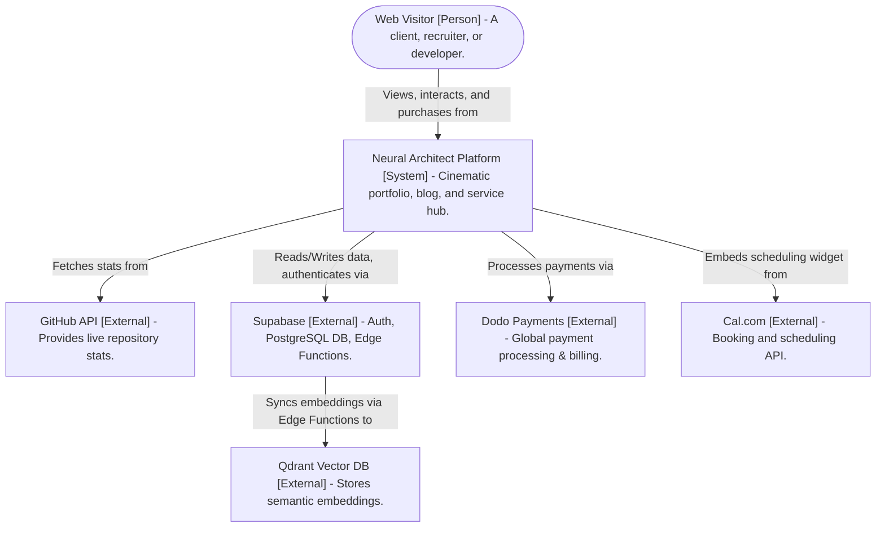
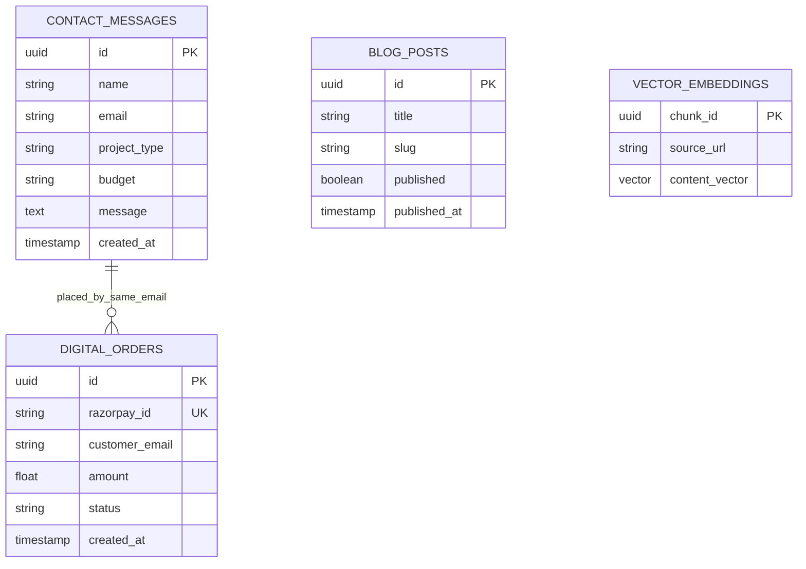
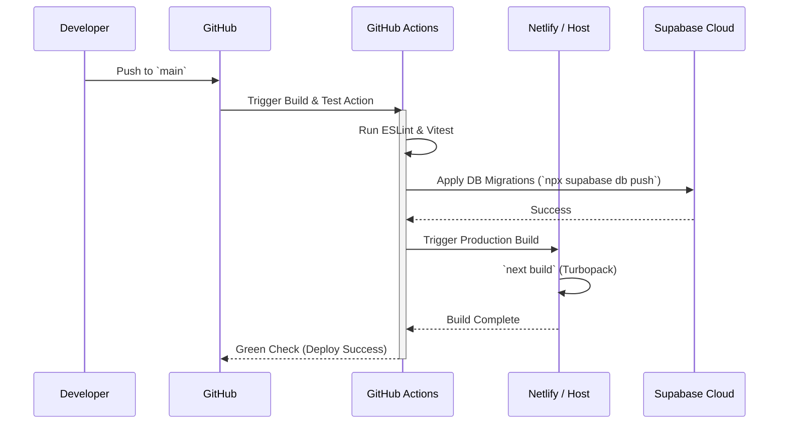

# Technology Steering: Neural Architect

## 1. System Design: C4 Context Model


```

---

## 2. Exhaustive Tech Stack Matrix

| Layer | Dependency | Version | Justification / Purpose | Absolute Path |
| :--- | :--- | :--- | :--- | :--- |
| **Framework** | Next.js | `^16.1.6` | App Router provides mixed SSR/SSG. Edge API routes handle lightweight endpoints. | [`package.json`](file:///d:/Antigravity/Projects/Portfolio/package.json) |
| **UI Library** | React | `^19.2.4` | Server Components reduce client bundle. Context API used for global state (Themes). | [`package.json`](file:///d:/Antigravity/Projects/Portfolio/package.json) |
| **Styling** | Tailwind CSS | `^3.4.1` | Atomic CSS utility classes mixed with local CSS modules for extreme customizability. | [`tailwind.config.ts`](file:///d:/Antigravity/Projects/Portfolio/tailwind.config.ts) |
| **Animations** | Framer Motion | `^12.34.3`| Handles granular micro-interactions, modal pop-ups, and step-wizard states. | [`package.json`](file:///d:/Antigravity/Projects/Portfolio/package.json) |
| **Cinematic UI** | GSAP | `^3.14.2` | ScrollTrigger manages complex, multi-component wave rendering and timeline pinning. | [`GSAPRegistrar.tsx`](file:///d:/Antigravity/Projects/Portfolio/src/components/home/GSAPRegistrar.tsx) |
| **WebGL & 3D** | Three.js + Fiber | `^0.183.1`| Performs GPU-accelerated background rendering (stars, grids, particles) without DOM thrashing. | [`BackgroundSystem.tsx`](file:///d:/Antigravity/Projects/Portfolio/src/components/BackgroundSystem.tsx) |
| **Database** | Supabase JS | `^2.103.0`| Interacts with Postgres tables, stores contact submissions, manages Auth for the `/admin` panel. | [`supabase/`](file:///d:/Antigravity/Projects/Portfolio/supabase/) |
| **Vector Engine** | Qdrant Client | `^1.18.0` | Enables high-speed semantic search over case studies and blogs for the RAG AI Chatbot. | [`qdrant.ts`](file:///d:/Antigravity/Projects/Portfolio/src/lib/qdrant.ts) |

---

## 3. Database Schema Overview (Entity Relationship)



---

## 4. CI/CD & Deployment Pipeline



---

## 5. Security & Performance Constraints

> [!IMPORTANT]
> **Zero Global CSS Pollution**: All non-Tailwind styling MUST reside in `.module.css` files. Global scoping is prohibited except for theme variables in `globals.css`.

> [!WARNING]
> **Idempotency in Payments**: Digital product webhooks MUST use Supabase `upsert` with `onConflict: 'dodo_payment_id'` to prevent duplicate deliveries.

> [!TIP]
> **Edge Caching**: GitHub API fetches MUST utilize Next.js `fetch` caching with `revalidate: 3600` to prevent rate-limiting during high traffic spikes.
